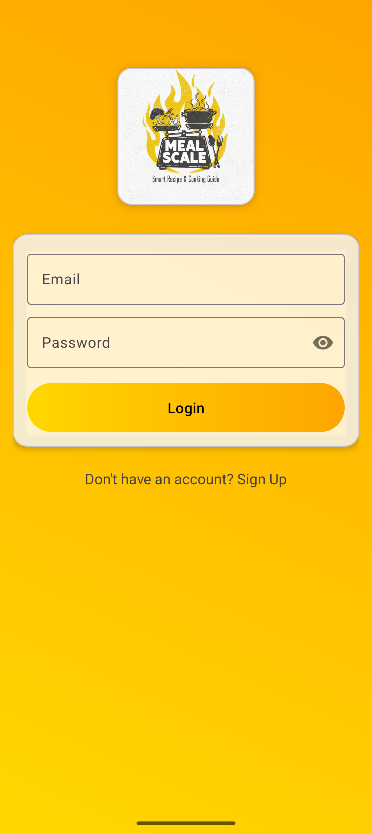
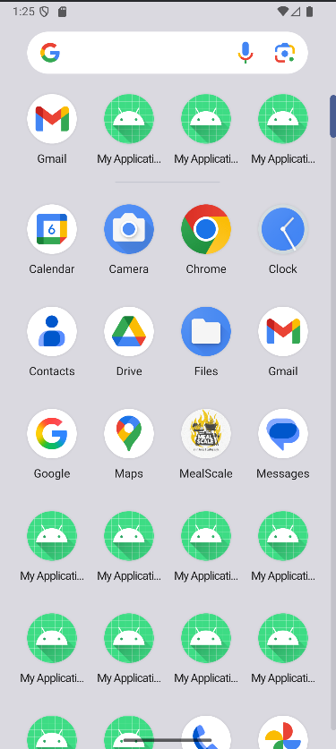
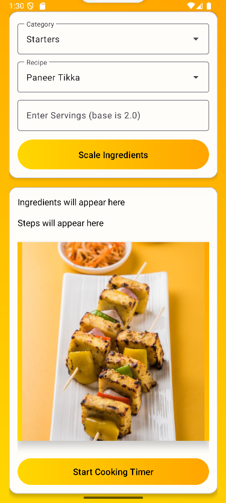

# 🍽️ MealScale – Smart Recipe & Cooking Guide

A minor project for BCA, Semester V.

## 📖 Overview

#MealScale is an Android app that personalizes cooking by scaling recipes based on available ingredients, guiding users step-by-step, and including a built-in timer.

---

### Developed By

* **Yuvraj Saini** (23FS10BCA00057)
* **Aditya Gandhi** (23FS10BCA00009)

**Course:** BCA – V Semester  
**Subject:** CA3170

---

## 🍳 Features

* **Splash Screen:** A welcoming splash screen (`activity_login.xml`) to launch the app.
* **User Login:** A simple login interface to get started.
* **Recipe Dashboard:** A main screen (`activity_main.xml`) to display and browse a wide variety of recipes.
* **Extensive Recipe Database:** Includes dozens of recipes with images, from `aloo_gobi` to `veg_spring_rolls`.
* **Custom UI:** Features custom-styled elements like gradient backgrounds (`gradient_background.xml`).

## 🛠️ Technologies Used

* **Language:** Kotlin
* **Platform:** Android Native
* **IDE:** Android Studio
* **UI:** XML (eXtensible Markup Language)
* **Build System:** Gradle

## 🚀 How to Run

To run this project:

1.  **Clone the repository:**
    ```bash
    git clone [https://github.com/Yuviiii67/minor-project-yuvraj-aditya.git](https://github.com/Yuviiii67/minor-project-yuvraj-aditya.git)
    ```
2.  **Open in Android Studio:**
    * Open Android Studio.
    * Select "Open" or "Open an existing Android Studio project".
    * Navigate to the cloned `minor-project-yuvraj-aditya` folder and select it.
3.  **Sync Gradle:** Let Android Studio build the project and sync the Gradle files.
4.  **Run:** Select an emulator or a physical device and click the "Run" button.

## 📸 Screenshots

Here is a look at the application's interface.

| Splash Screen | Login Page | Home Page (Grid View) |
| :---: | :---: | :---: |
|  |  |  |

| Recipe Categories | Recipe Details | Ingredient Scaling |
| :---: | :---: | :---: |
|  |  |  |

## 📁 File Structure

Here is the high-level structure of the `app/src` directory, which contains all the source code for the application.

```bash
app
└───src
    ├───androidTest
    │   └───java
    │       └───com/example/myapplication
    │               └── ExampleInstrumentedTest.kt
    │
    ├───main
    │   │   AndroidManifest.xml
    │   │
    │   ├───java
    │   │   └───com/example/myapplication
    │   │           LoginActivity.kt
    │   │           MainActivity.kt
    │   │
    │   └───res
    │       ├───drawable
    │       │       aloo_gobi.png
    │       │       ... (and 30+ other recipe images)
    │       │
    │       ├───layout
    │       │       activity_login.xml
    │       │       activity_main.xml
    │       │
    │       ├───mipmap-anydpi-v26
    │       │       ic_launcher.xml
    │       │       ic_launcher_round.xml
    │       │
    │       ├───mipmap-hdpi (and mdpi, xhdpi, etc.)
    │       │       ... (app launcher icons)
    │       │
    │       ├───values
    │       │       colors.xml
    │       │       strings.xml
    │       │       themes.xml
    │       │
    │       ├───values-night
    │       │       themes.xml
    │       │
    │       └───xml
    │               backup_rules.xml
    │               data_extraction_rules.xml
    │
    └───test
        └───java
            └───com/example/myapplication
                    └── ExampleUnitTest.kt
